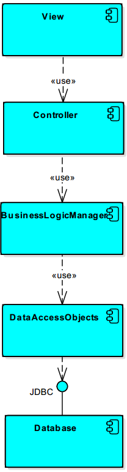
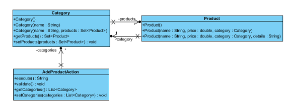
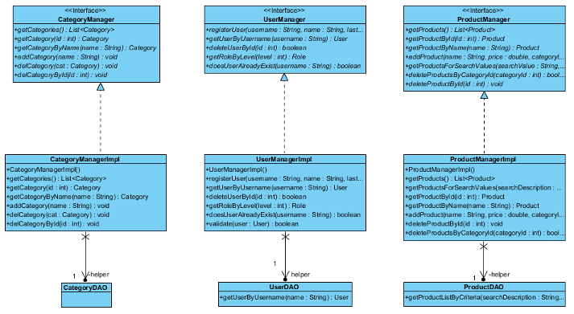
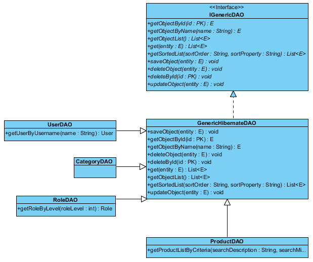
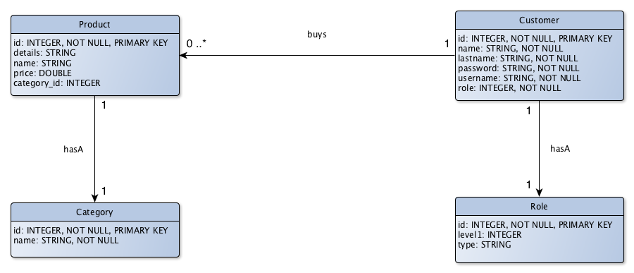
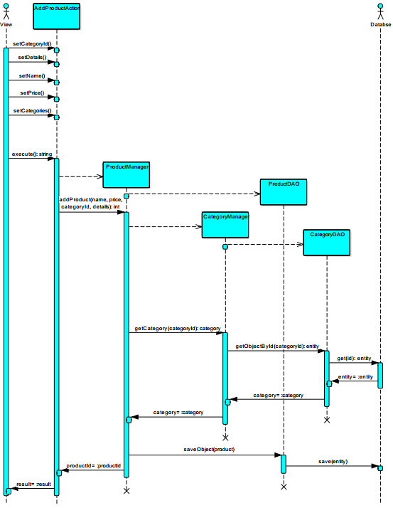

---
title: Deliverable 1 – Analyse der Legacy Anwendung
author:
    - Simon Blum
    - Johannes Dillmann
    - Julian Keppel
    - Daniel Kraus
documentclass: scrartcl
urlcolor: blue
...

Die vorliegende Dokumentation befasst sich mit der bereitgestellten Legacy-Anwendung des Webshops. Es wird sowohl die Struktur und Architektur der Anwendung, sowie das Verhalten und die Kommunikation zwischen den Komponenten beleuchtet.

# Strukturelle Analyse #

## Architektur der Anwendung ##
Die gesamte Anwendung ist als monolitische Struktur in einem gemeinsamen Archiv gebündelt. Sie ist in mehrere Schichten eingeteilt, welche jeweils in Package-Ebene voneinander getrennt sind. Der View-Layer wird durch JSP-Files und dem Struts-2-Framework implementiert. Von hier aus werden die Requests vom Browser an die jeweiligen Controller-Instanzen geleitet. Die Controller erzeugen die jeweils benötigten Manager-Instanzen aus dem Business-Logic-Layer. Von hier aus gelangen die Aufrufe zu den Datenzugriffsobjekten (DAO), welche die Verbindung zur Datenbank durch das JPA-Framework Hibernate kapseln. 

Die folgende Abbildung zeigt die Architektur und alle Hauptkomponenten im Überblick:



## Klassenstruktur ##
Die Struktur der Klassen bildet im Wesentlichen das MVC (Model View Controller) Architekturmuster ab. Eine Ausnahme stellen dabei jedoch die Views dar, da diese als JSPs (Java Server Pages) vorliegen. Die Controller liegen im gleichnamigen Paket und stellen, im Kontext von Struts 2, jeweils Actions dar. So existiert beispielsweise für das Anlegen einer Kategorie die Klasse `AddCategoryAction` oder für das Abrufen von Details zu einem Produkt die Klasse `ProductDetailsAction`. Nach diesem Schema sind alle Aktionen auf einen bestimmten Controller abbildbar. 


Der Zugriff auf die Datenbank beziehungsweise die Model Schicht erfolgt über die Klassen im Paket `model`. Alle notwendigen Entitäten wie Benutzer, Kategorie oder Produkte sind als eigenständige Klassen gekapselt. Die Interaktion mit diesen Elementen geschieht, auf Ebene der Geschäftslogik, über diverse Manager-Klassen. Diese Logik ist wiederum in ein spezifisches Interface sowie eine zugehörige Implementierung geteilt. Für Produkte existiert dabei das Interface `ProductManager` und die zugehörige Implementierung `ProductManagerImpl` welche die Zugriffe entsprechend kapselt. 



Der Zugriff auf die Datenbank erfolgt über, jeweils zu den Elementen passenden, DAO Klassen. Die Klasse `GenericHibernateDAO` implementiert selbst das Interface `IGenericDAO` und stellt eine Basisklasse dar, welche durch entsprechende Spezialisierungen erweitert wird. Als Beispiel sei hierbei die Klasse `CategoryDAO` genannt, welche für den Zugriff auf `Category` Objekte aus der Datenbank zuständig ist. 


## Datenmodell ##
Das folgende Entity Relationship Modell repräsentiert das Datenmodell der Legacy Anwendung. Es existieren vier Datenobjekte, welche die Kunden(`Customer`), die Rolle des einzelnen Kunden(`Role`), Kategorien(`Category`) und Produkte(`Product`) darstellen. Dabei kann ein Kunde lediglich eine Rolle einnehmen. Ein Produkt kann alleinig einer Kategorie zugehörig sein. Der Zusammenhang zwischen Kunde und Produkt spiegelt eine `1:n` Beziehung wider, das heißt ein Kunde kann beliebig viele Produkte erwerben.



# Analyse des Verhaltens #

## Funktionale Spezifikation ##
Der Webshop bietet folgende Funktionen:

- Registrierung
- Login
- Produktsuche
- Produkt hinzufügen/entfernen
- Kategorie hinzufügen/entfernen

Hierbei können die letzten beiden Funktionalitäten ausschließlich von Administratoren verwendet werden. Um das korrekte Verhalten der Anwendung hinsichtlich dieser Funktionen auch nach dem Umbau verifizieren zu können, wurde nach dem Prinzip des *Golden Master Testing* (auch bekannt als Characterization Testing oder Behavorial Diff) vorgegangen. Dabei wird die Charakteristik der Anwendung in Form von (Integrations) Tests persitiert, wodurch Änderungen am Legacy Code durchgeführt und anschließend geprüft werden können.

Im vorliegenden Fall das Capture-and-Replay-Tool [Selenium IDE](http://www.seleniumhq.org/projects/ide/) verwendet. Die Tests werden hierbei einmalig manuell durchgeführt und dabei aufgezeichnet (Capture), anschließend können diese beliebig oft und vollautomatisch wiederholt werden (Replay). Für gewöhnlich "lauscht" das Tool zu diesem Zweck auf verschiedene Events im Browser, wie etwa Mausklicks oder Tastatureingaben, und erstellt auf dieser Basis ein Testskript. Dies hat den Vorteil, dass Tests rasch erstellt werden können und keine Programmierkenntnisse voraussetzen, wodurch sich solche Tools besonders für Domänenexperten eignen. Die XML-Testskripte können anschließend als JUnit-Tests nach Java exportiert werden. Nachfolgend ein Beispiel für den Login-Vorgang des Admins:

```java
@Test
public void testLoginAdmin() throws Exception {
    driver = new FirefoxDriver();
    driver.manage().timeouts().implicitlyWait(
        IntegrationTestsConfig.IMPLICIT_WAIT, TimeUnit.SECONDS);
    driver.get(IntegrationTestsConfig.BASE_URL);
    driver.findElement(By.id("LoginAction_username")).clear();
    driver.findElement(By.id("LoginAction_username")).sendKeys("admin");
    driver.findElement(By.id("LoginAction_password")).clear();
    driver.findElement(By.id("LoginAction_password")).sendKeys("admin");
    driver.findElement(By.id("LoginAction__execute")).click();
    try {
        if (Locale.getDefault().toString().equalsIgnoreCase("en_US")) {
            assertEquals("Add product", driver.findElement(
                By.linkText("Add product")).getText());
        } else {
            assertEquals("Produkt hinzufügen", driver.findElement(
                By.linkText("Produkt hinzufügen")).getText());
        }
    } catch (Error e) {
        verificationErrors.append(e.toString());
    }
    try {
        if (Locale.getDefault().toString().equalsIgnoreCase("en_US")) {
            assertEquals("Edit categories", driver.findElement(
                By.linkText("Edit categories")).getText());
        } else {
            assertEquals("Kategorien bearbeiten", driver.findElement(
                By.linkText("Kategorien bearbeiten")).getText());
        }
    } catch (Error e) {
        verificationErrors.append(e.toString());
    }
    try {
        if (Locale.getDefault().toString().equalsIgnoreCase("en_US")) {
            assertEquals("You are logged in as admin admin", 
                driver.findElement(By.cssSelector("div.row")).getText());
        } else {
            assertEquals("Sie sind eingeloggt als admin admin", 
                driver.findElement(By.cssSelector("div.row")).getText());
        }
    } catch (Error e) {
        verificationErrors.append(e.toString());
    }
    driver.findElement(By.linkText("Logout")).click();
}
```

## Ablauf eines Beispiel-Workflows ##
Anhand des Workflows "Produkt hinzufügen" wird exemplarisch die Kommunikation sowie das Verhalten der einzelnen Komponenten gezeigt. Es fällt auf, dass offensichtlich bei jeder Anfrage ein neuer `ProductManager`, `CategoryManager` sowie die zugehörigen Datenzugriffsobjekte erstellt werden. 

Im folgenden Sequenzdiagramm ist der beispielhafte Workflow innerhalb der gesamten Anwendung abgebildet:


