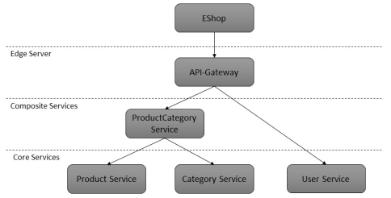

# Architekturentwurf
Die Webanwendung behält ihre Business Logik vollständig bei und die Services werden somit als datenzentrierte Dienste entworfen. In den BusinessLogic-Managern werden alle DAO-Aufrufe durch entsprechende Service-Calls ersetzt. Alle Requests werden zunächst in einem API-Gateway gesammelt und an die entsprechenden darunter liegenden Komponenten geleitet.

Als Kerndienste wurden ein Product-Service, ein Category-Service sowie ein User-Service identifiziert. Da die Entitäten der Produkte und Kategorien im Datenmodell eng miteinander verknüpft sind, wurden diese beiden mithilfe eines Composite-Services zusammengefasst, welcher als einheitliche Schnittstelle dieser beiden Dienste fungiert.

Folgende Abbildung zeigt die Service-Architektur mit seinen Abstraktionsschichten im Überblick:



# Services
- User Service
- Product Service
- Category Service
- Product Category Service


## User Service
Dient dem Anlegen und Abfragen der vorhandenen Benutzer.

### Endpunkte
| Verb | URI | Parameter | Beschreibung |
|------|-----|-----------|--------------|
| GET  | /user/{id} |  | Gibt genau einen Benutzer zurück |
| POST | /user      |  | Fügt einen neuen Benutzer hinzu |

## Request/Response
Beispiel:
- Request: POST /user

```javascript
{
    "username": "hlüning",
    "fistname": "Horst",
    "lastname": "Lüning",
    "password": "1234"
    "role": "admin"
}
```

- Response:

```javascript
{
    "id": "1234",
    "username": "hlüning",
    "fistname": "Horst",
    "lastname": "Lüning",
    "password": "1234"
    "role": "admin"
}
```

### API
```yaml
#%RAML 0.8
title: User Service
baseUri: http://localhost
mediaType: application/json
version: v0.1

/user:
  post:
    description: creates a new user
    body:
      application/json:
        schema: |
          {
            "$schema": "http://json-schema.org/draft-04/schema#",
            "id": "http://jsonschema.net",
            "type": "object",
            "required": "true",
            "properties":
              {
                "username": "string",
                "fistname": "string",
                "lastname": "string",
                "password": "string",
                "role":
                  {
                    "enum": ["admin", "user"]
                  }
              }
          }
        example: |
          {
            "username": "hlüning",
            "fistname": "Horst",
            "lastname": "Lüning",
            "password": "1234",
            "role": "admin"
          }
  /{id}:
    get:
      description: get a specific user by id
      responses:
        200:
          body:
            application/json:
              schema: |
                {
                  "$schema": "http://json-schema.org/draft-04/schema#",
                  "id": "http://jsonschema.net",
                  "type": "object",
                  "required": "true",
                  "properties":
                    {
                      "id": "integer",
                      "username": "string",
                      "fistname": "string",
                      "lastname": "string",
                      "password": "string",
                      "role":
                        {
                          "enum": ["admin", "user"]
                        }
                    }
                }
              example: |
                {
                  "id": "1234",
                  "username": "hlüning",
                  "fistname": "Horst",
                  "lastname": "Lüning",
                  "password": "1234",
                  "role": "admin"
                }

```

## Category Service
Dient dem Anlegen, Abfragen und Löschen von Kategorien.

### Endpunkte

| Verb | URI | Parameter | Beschreibung |
|------|-----|-----------|--------------|
| GET  | /category      |  | Gibt alle Kategorien zurück |
| GET  | /category/{id} |  | Gibt genau eine Kategorie zurück |
| POST | /category      |  | Fügt einen neue Kategorie hinzu |
| DELETE  | /category/{id} |  | Ändert eine bestehende Kategorie |

### API
```yaml
#%RAML 0.8
title: Category Service
baseUri: http://localhost
mediaType: application/json
version: v0.1

/category:
  post:
    description: creates a new category
    body:
      application/json:
        schema: |
          {
            "$schema": "http://json-schema.org/draft-04/schema#",
            "id": "http://jsonschema.net",
            "type": "object",
            "required": "true",
            "properties":
              {
                "name": "string"
              }
          }
  get:
    description: get all categories
    responses:
      200:
        body:
          application/json:
            schema: |
              {
                "$schema": "http://json-schema.org/draft-04/schema#",
                  "id": "http://jsonschema.net",
                  "type": "object",
                  "required": "true",
                  "properties":
                  {
                    "categories": ["object"]
                  }
              }
  /{id}:
    delete:
      description: delete a specific category
    get:
      description: get a specific category by id
      responses:
        200:
          body:
            application/json:
              schema: |
                {
                  "$schema": "http://json-schema.org/draft-04/schema#",
                  "id": "http://jsonschema.net",
                  "type": "object",
                  "required": "true",
                  "properties":
                    {
                      "id": "integer",
                      "name": "string"
                    }
                }

```

## Product Service
Dient dem Anlegen, Abfragen und Löschen von Produkten.

### Endpunkte
| Verb | URI | Parameter | Beschreibung |
|------|-----|-----------|--------------|
| GET  | /product      | filter | Gibt alle, oder je nach Filter nur einige, Produkte zurück |
| GET  | /product/{id} |  | Gibt genau ein Product zurück |
| POST | /product      |  | Fügt eine neues Produkt hinzu |
| DELETE  | /product/{id} |  | Entfernt ein bestehendes Produkt |


### Request/Response
Beispiel: GET /category/12

```javascript
{
    "id": 12,
    "name": "whisky"
}
```

Beispiel: GET /product/?name=Jameson

```javascript
{
    "products": [1234, 765]
}
```

Beispiel: GET /product/?minPrice=100

```javascript
{
    "products": [12, 15, 45, 57, 96]
}
```

Beispiel: GET /product/1234

```javascript
{
    "id": 1234,
    "name": "Jameson Limited Reserve 18 Jahre",
    "price": "79.90",
    "category": "whisky",
    "details": "Selten werden irische Whiskeys so alt abgefüllt. Dies ist eine Komposition lang gereifter irischer Whiskeys. Sicherlich einer der besten Whiskeys aus Irland."
}
```

Beispiel:
- Request: POST /product

```javascript
{
    "name": "Jameson Gold",
    "price": "49.90",
    "category": "whisky",
    "details": "Der Jameson Gold ist der hochwertigste Jameson in unlimitierter Abfüllung. Ein frischer Whiskey mit komplexen Pot Still Charakter, der durch eine Portion Sherryfass Whiskey abgemildert wird. Der Abgang ist lang und kräftig."
}
```

```javascript
{
    "id": 765,
    "name": "Jameson Gold",
    "price": "49.90",
    "category": "whisky",
    "details": "Der Jameson Gold ist der hochwertigste Jameson in unlimitierter Abfüllung. Ein frischer Whiskey mit komplexen Pot Still Charakter, der durch eine Portion Sherryfass Whiskey abgemildert wird. Der Abgang ist lang und kräftig."
}
```

### API
```yaml
#%RAML 0.8
title: Product Service
baseUri: http://localhost
mediaType: application/json
version: v0.1

/product:
  post:
    description: creates a new product
    body:
      application/json:
        schema: |
          {
            "$schema": "http://json-schema.org/draft-04/schema#",
            "id": "http://jsonschema.net",
            "type": "object",
            "required": "true",
            "properties":
              {
                "name": "string",
                "price": "double",
                "details": "string",
                "category": "integer"
              }
          }
  get:
    description: get all products
    responses:
      200:
        body:
          application/json:
            schema: |
              {
                "$schema": "http://json-schema.org/draft-04/schema#",
                  "id": "http://jsonschema.net",
                  "type": "object",
                  "required": "true",
                  "properties":
                  {
                    "products": ["object"]
                  }
              }
  /{id}:
    delete:
      description: delete a specific product
    get:
      description: get a specific product by id
      responses:
        200:
          body:
            application/json:
              schema: |
                {
                  "$schema": "http://json-schema.org/draft-04/schema#",
                  "id": "http://jsonschema.net",
                  "type": "object",
                  "required": "true",
                  "properties":
                    {
                      "id": "integer",
                      "name": "string",
                      "price": "double",
                      "details": "string",
                      "category": "integer"
                    }
                }

```

## Product Category Service
Dieser Dienst bietet Zugriff auf den darunterliegenden `Product` und `Category` Service. Dabei sorgt er auch für die Einhaltung der Konsistenz, da zwar eine Kategorie ohne Produkt, ein Produkt niemals ohne Kategorie existieren darf.

### API
```yaml
#%RAML 0.8
title: Product Category Composite Service
baseUri: http://localhost
mediaType: application/json
version: v0.1

/category:
  post:
    description: creates a new category
    body:
      application/json:
        schema: |
          {
            "$schema": "http://json-schema.org/draft-04/schema#",
            "id": "http://jsonschema.net",
            "type": "object",
            "required": "true",
            "properties":
              {
                "name": "string"
              }
          }
  get:
    description: get all categories
    responses:
      200:
        body:
          application/json:
            schema: |
              {
                "$schema": "http://json-schema.org/draft-04/schema#",
                  "id": "http://jsonschema.net",
                  "type": "object",
                  "required": "true",
                  "properties":
                  {
                    "categories": ["object"]
                  }
              }
  /{id}:
    delete:
      description: delete a specific category
    get:
      description: get a specific category by id
      responses:
        200:
          body:
            application/json:
              schema: |
                {
                  "$schema": "http://json-schema.org/draft-04/schema#",
                  "id": "http://jsonschema.net",
                  "type": "object",
                  "required": "true",
                  "properties":
                    {
                      "id": "integer",
                      "name": "string"
                    }
                }

/product:
  post:
    description: creates a new product
    body:
      application/json:
        schema: |
          {
            "$schema": "http://json-schema.org/draft-04/schema#",
            "id": "http://jsonschema.net",
            "type": "object",
            "required": "true",
            "properties":
              {
                "name": "string",
                "price": "double",
                "details": "string",
                "category": "integer"
              }
          }
  get:
    description: get all products
    responses:
      200:
        body:
          application/json:
            schema: |
              {
                "$schema": "http://json-schema.org/draft-04/schema#",
                  "id": "http://jsonschema.net",
                  "type": "object",
                  "required": "true",
                  "properties":
                  {
                    "products": ["object"]
                  }
              }
  /{id}:
    delete:
      description: delete a specific product
    get:
      description: get a specific product by id
      responses:
        200:
          body:
            application/json:
              schema: |
                {
                  "$schema": "http://json-schema.org/draft-04/schema#",
                  "id": "http://jsonschema.net",
                  "type": "object",
                  "required": "true",
                  "properties":
                    {
                      "id": "integer",
                      "name": "string",
                      "price": "double",
                      "details": "string",
                      "category": "integer"
                    }
                }

```
